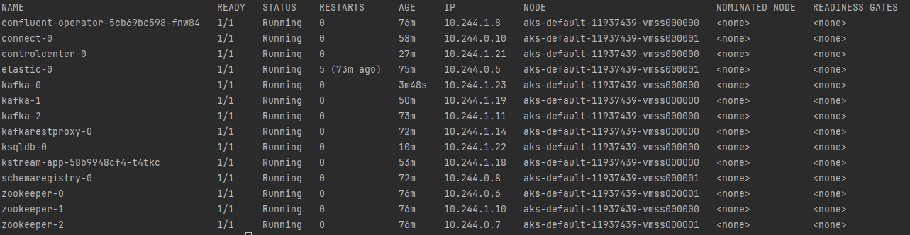
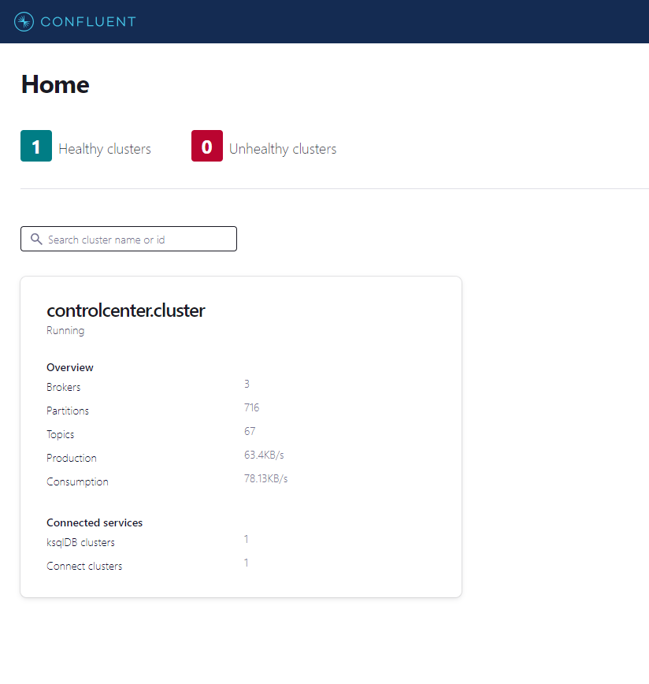
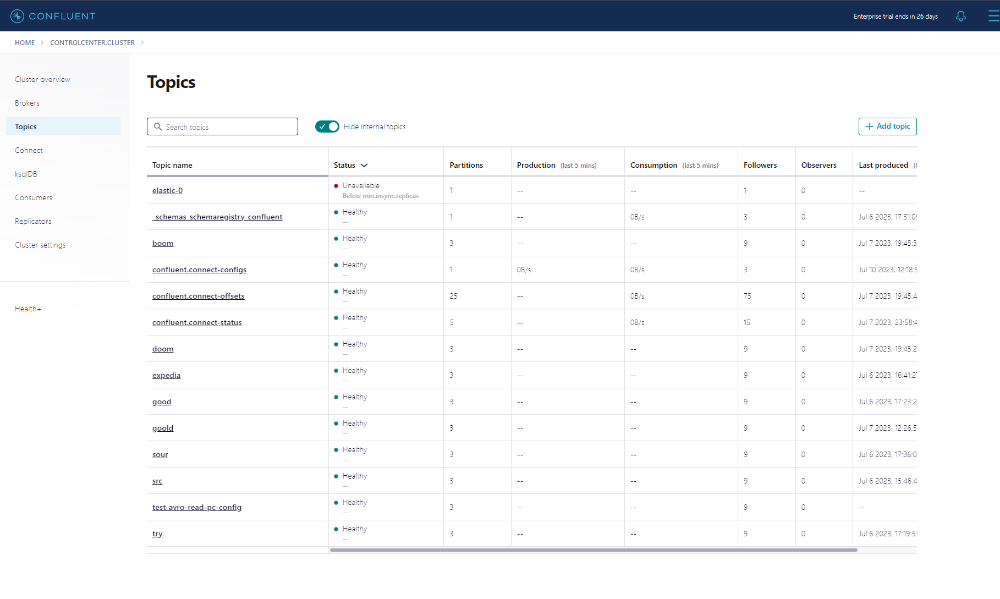
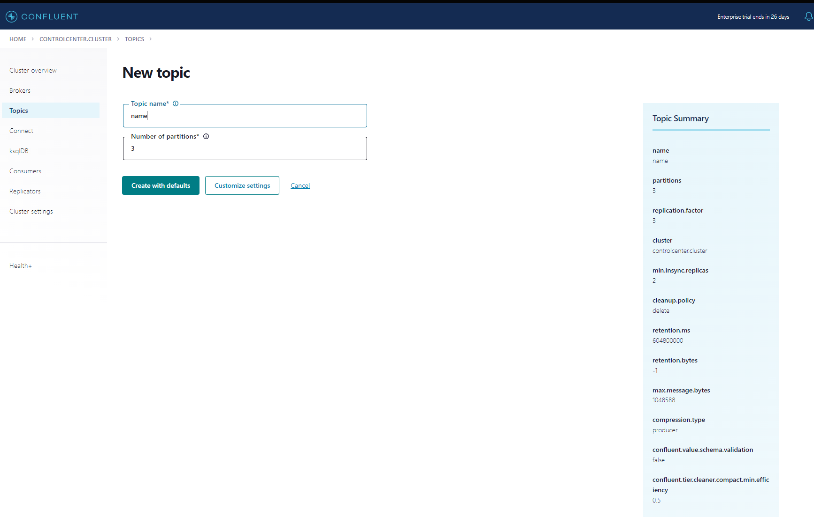
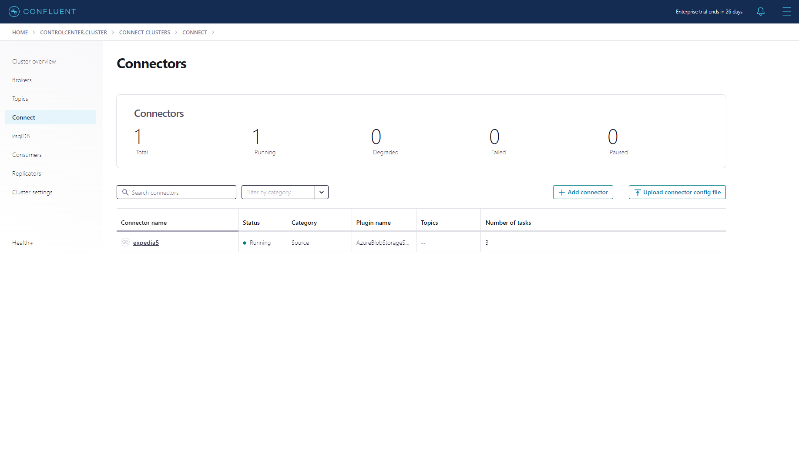
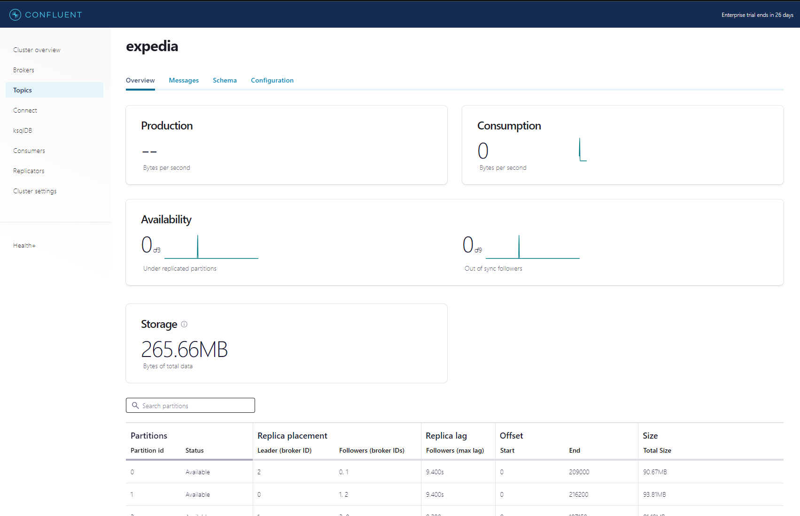
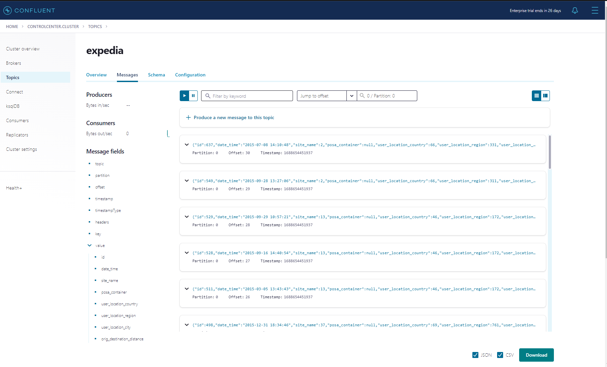
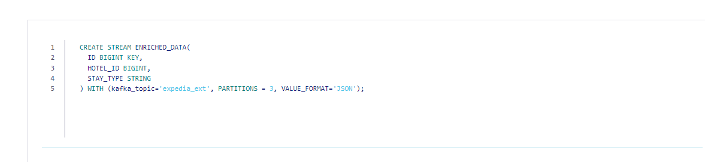
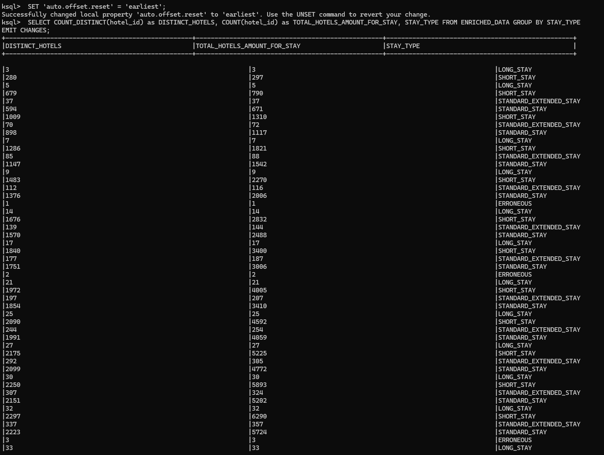

# Running the application
### 1.1. run (first-time)
```` make first-run connectors-img=docker_acc/connector_img_name:vers streams-img==docker_acc/streams_job_img_name:vers````(if you didn't change the vars in tf vars then no changes are expected otherwise follow what's written )
### 1.2. If not for the first time (img is present)
```` make subs-run connectors-img=docker_acc/connector_img_name:vers streams-img==docker_acc/streams_job_img_name:vers````
### 1.3. if it's the first run but architecture already exists
```` make get-key-and-apply-infra connectors-img=docker_acc/connector_img_name:vers streams-img==docker_acc/streams_job_img_name:vers````

#### 2.0. (Wait untill all services are running, verify by):
```` kubectl get pods -o wide````
##### You should see something similar to this 

### 2. Open tunnel in a separate terminal and run and create a topic using UI with 3 partitions
```` make tunnel-control-center````







### 3. Open tunnel in a separate terminal and run(abort tunnel from prev step if necessary)
```` make tunnel-connect````

### 4. Open separate terminal and run
````make submit-connector````


# RESULTS
After you have submitted the job you should see smth like this

The topic itself should look like



after running this query


stream is created

to get resulting values we need to access ksqldb cli 
```` kubectl exec --stdin --tty ksqldb-0 -- /bin/ksql````
And now we can reset the offset and read the data
